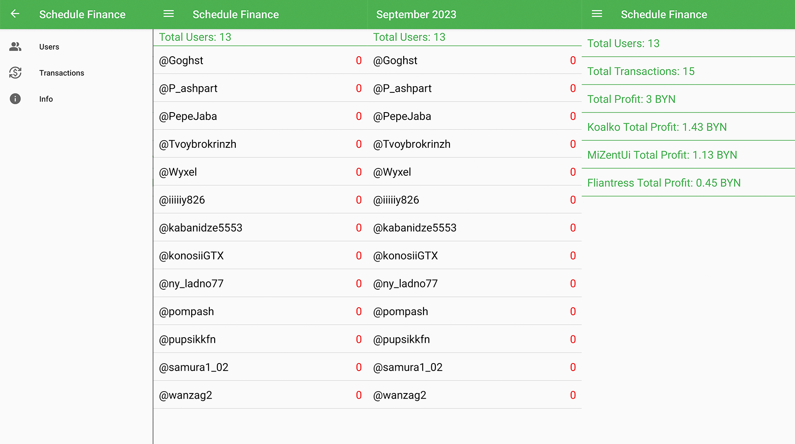

# Schedule Finance

**Schedule Finance** is a mobile app for managing subcriptions to class schedules provided by Telegram bot. This project requires a [Firebase Project](https://firebase.google.com/).

**Features include:**

- Subscriptions balance evaluating
- Full transactions history
- Total project stats

## License

[MIT © Denis Skrobot](LICENSE)